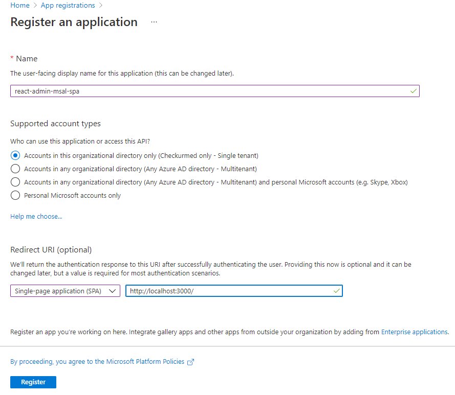
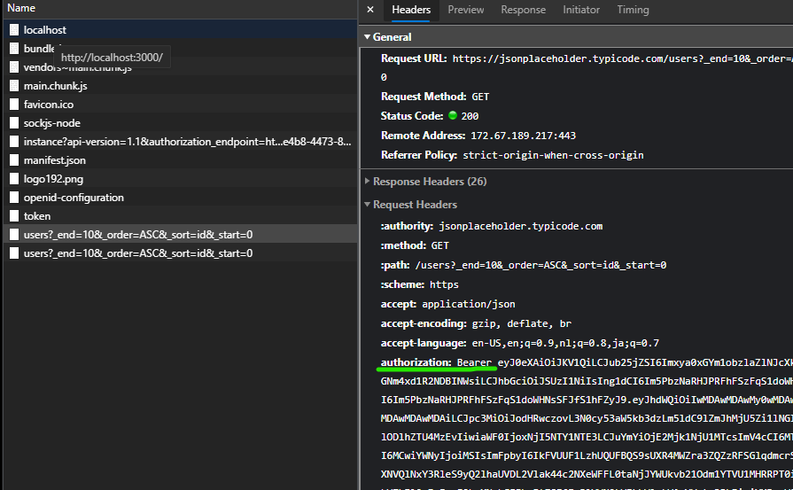

# React-Admin integration with MSAL.js 2.0

This example shows one way to integrate Azure Active Directory with [React-admin](https://marmelab.com/react-admin/).

Disclaimer: This may not be the perfect implementation but it worked for my personal use case. I am not a Javascript developer so YMMV!

This example uses the MSAL.js 2.0 libraries:

- [@azure/msal-react](https://www.npmjs.com/package/@azure/msal-react)
- [@azure/msal-browser](https://www.npmjs.com/package/@azure/msal-browser)

## How to run

To run this example you need to set up a SPA application in Azure AD:



Then set up a local _.env_ file that contains the Tenant ID and Client ID of this app:
```
REACT_APP_TENANT_ID=xxxxxxxx-xxxx-xxxx-xxxx-xxxxxxxxxxxx 
REACT_APP_CLIENT_ID=xxxxxxxx-xxxx-xxxx-xxxx-xxxxxxxxxxxx
```
OR alternatively replace the corresponding _process.env_ variables in _src/authConfig.js_

## See it working
In this example we call the generic [JSONPlaceholder](https://jsonplaceholder.typicode.com/) API and are passing the token in dataProvider.js

Although JSONPlaceholder does not require authentication, we can see the bearer token successfully being passed by inspecting the Request Headers via devtools:


